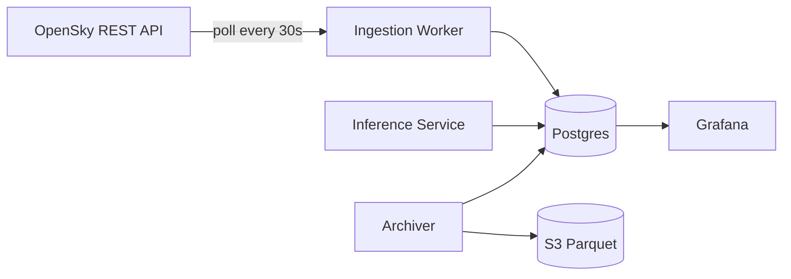

# aero-telemetry-engine

A fault-tolerant, near-real-time aviation telemetry pipeline in .NET and PostgreSQL, with a decoupled PyTorch anomaly-detection service, deployed to AWS through Terraform and CI/CD, with measured recovery from failures.

**Status:** in progress (Phase 0 — Foundation)

See [docs/PRD.md](docs/PRD.md) for the full project spec, roadmap, and decision log.

## Architecture



(Full diagram in [docs/PRD.md](docs/PRD.md#41-diagram); to be exported as a standalone image in Phase 4.)

## Quick start

```bash
cp .env.example .env
docker compose up
```

## Roadmap

See Section 9 of the [PRD](docs/PRD.md) for the phased task list.
