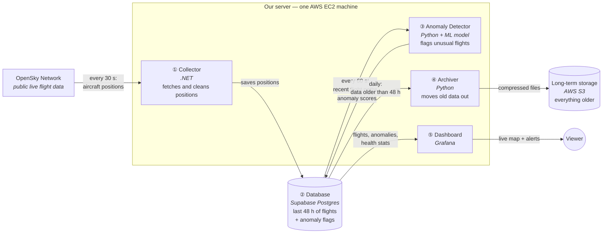
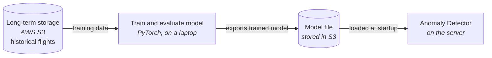
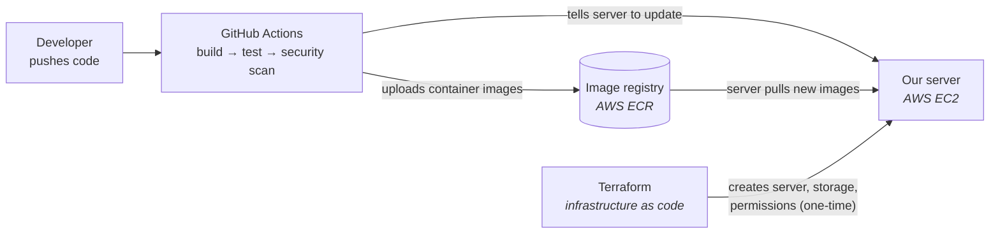

# PRD: Real-Time Telemetry & AI Analytics Engine

**Repo name:** `aero-telemetry-engine`
**Document version:** 2.0 (rewritten September 2026)
**Owner:** charmaine
**Purpose of this project:** Portfolio project for job hunting in backend/systems engineering, cloud/DevOps, forward-deployed engineering, and ML infrastructure roles.

---

## 0. Current Status (update this block every time you work)

```
PHASE:          1 — Ingestion and Storage
CURRENT TASK:   P1.2
LAST UPDATED:   2026-09-24
DONE SINCE LAST UPDATE:
  - P1.1 done. Five DbUp migrations in db/migrations, applied by the new
    src/Ingestion/Ingestion.Migrations one-shot console app. Everything is in
    a `telemetry` schema, not `public` (D13 / ADR 0003). Verified on a clean
    Postgres 17: 5 scripts applied, second run is a no-op, staging ->
    INSERT ON CONFLICT dedupes within a batch and on replay.
  - state_vectors has no partitions yet; inserts fail until P1.2.
  - Local Postgres moved to host port 5433 (a native Windows Postgres owns
    5432). Migrations applied to the compose database.
BLOCKERS:
  - Supabase direct host db.<ref>.supabase.co is IPv6-only and unreachable from
    this machine (verified: AAAA only, TCP :5432 fails). Need the SESSION-mode
    pooler connection string from the Supabase dashboard before migrations
    can be applied to Supabase. Local Postgres is unaffected.
  - Official postgres:17 image has no pg_partman / pg_cron. P1.2 needs a
    small local image that installs postgresql-17-partman and -cron.
OPEN QUESTIONS:
  - Keep the Benelux/NW Europe box (48.0,2.0 -> 53.0,7.0) or pick another region?
MEASURED NUMBERS SO FAR:
  - 319 aircraft in one poll of the 25 sq deg box (2026-09-18).
  - 1 OpenSky credit per call confirmed (X-Rate-Limit-Remaining 3997 after 3 calls).
```

### Instructions for AI assistants reading this document

1. This document is the single source of truth for the project. Read it fully before answering.
2. Check the **Current Status** block above to see where I am. Task IDs (e.g. `P1.4`) refer to Section 9.
3. Everything in the **Decision Log** (Section 11) is settled. Don't re-argue those choices unless I ask or you find a factual reason they no longer hold (e.g. a platform change).
4. Respect the **Non-Goals** (Section 3). Don't suggest adding Kafka, Kubernetes, a frontend framework, etc.
5. Facts in Section 12 were verified in September 2026. If something may have changed (API limits, free tiers, library versions), say so and check.
6. Help me build things I can explain in an interview. Prefer simple, well-justified solutions over adding more technologies.

---

## 1. Project Summary

A system that continuously ingests live aircraft position data from the OpenSky Network, stores it in a time-partitioned PostgreSQL database, archives older data to S3 as Parquet, and runs a PyTorch-trained model that scores flight trajectories for anomalies. Everything is containerised, provisioned with Terraform, and deployed to AWS EC2 through a GitHub Actions CI/CD pipeline. A Grafana dashboard shows live flights, anomaly scores, and pipeline health.

**One-sentence pitch (for a resume or interview):**
"A fault-tolerant, near-real-time aviation telemetry pipeline in .NET and PostgreSQL, with a decoupled PyTorch anomaly-detection service, deployed to AWS through Terraform and CI/CD, with measured recovery from failures."

**Honest framing:** Data arrives every ~30 seconds, so this is *near-real-time*. Always describe it that way.

---

## 2. Goals and Target Roles

| Target role | What the project proves | Where it's proven |
|---|---|---|
| Backend / systems engineer (defence, aerospace) | Reliable long-running services, fault tolerance, clean failure handling | Ingestion worker (Phases 1, 4) |
| Data / research infrastructure | Time-series schema design, partitioning, retention, archival | Storage layer (Phases 1, 3) |
| ML engineer / ML infrastructure | Data cleaning, feature pipelines, model evaluation, model serving | AI service (Phase 3) |
| DevOps / cloud / forward-deployed | Containers, IaC, CI/CD, secrets management, observability, cost control | Ops layer (Phase 2) |

### Success criteria (the project is "done" when all are true)

1. Ingestion has run continuously on AWS for at least 14 days, with uptime and gap statistics shown on the dashboard.
2. A recorded demo shows the system recovering automatically from: database outage, OpenSky rate limiting, and the AI service crashing.
3. The anomaly model has a written evaluation that compares it against a rule-based baseline, with precision/recall numbers.
4. Infrastructure can be rebuilt from scratch with `terraform apply` + one pipeline run.
5. The whole system also runs locally with a single `docker compose up`.
6. The README contains an architecture diagram, a failure-mode table, measured performance numbers, and a demo video link.

---

## 3. Non-Goals (deliberately out of scope)

- **No Kafka, RabbitMQ, or other message brokers.** Postgres is the integration point. Volume doesn't justify a broker.
- **No Kubernetes.** Docker Compose on one EC2 instance is enough and easier to explain.
- **No custom frontend framework (React etc.).** Grafana is the UI.
- **No user accounts or public write APIs.**
- **No global coverage.** One regional bounding box only (see Section 5).
- **No training on EC2.** Training happens locally or in a notebook environment; EC2 only serves the model.

---

## 4. Architecture

### 4.1 Diagrams

The architecture is three separate pictures, because they happen on different timelines:

| Diagram | When it happens |
|---|---|
| **A. How data flows** (the main one) | Continuously, while the system runs |
| **B. How the model is made** | Occasionally, offline on a laptop |
| **C. How code gets to the server** | On every push to `main` |

#### A. How data flows (the main diagram)

Arrows show which way the data moves. The technology is in *italics* under each box.



**In plain words:**

1. Every 30 seconds the **Collector** asks OpenSky where every aircraft in our region is. It throws out bad records and saves the rest.
2. The **Database** keeps only the last 48 hours, so it stays small and fast.
3. Every 60 seconds the **Anomaly Detector** reads each aircraft's recent path, scores how unusual it looks, and writes the score back.
4. Once a day the **Archiver** copies data older than 48 hours to cheap S3 storage, checks the copy is complete, and then deletes it from the database.
5. The **Dashboard** is what the viewer sees: a live map of aircraft, a list of flagged flights, and panels showing whether the pipeline is healthy.

**The key design decision:** the Collector and the Detector never talk to each other directly. They only share the database. If the ML side crashes, data collection carries on, and scoring catches up when the Detector comes back.

#### B. How the model is made (offline, occasionally)



Training never runs on the server. The server only loads the finished model file.

#### C. How code gets to the server (on every push)



A more detailed version of this pipeline is in `docs/diagrams/build-deploy-pipeline.excalidraw`.

### 4.2 Components

| Component | Responsibility | Key design points |
|---|---|---|
| **Ingestion Worker** (.NET 10) | Poll OpenSky, clean and validate records, write to Postgres | OAuth token lifecycle, resilience pipeline, bounded in-memory buffer, batched COPY, idempotent writes, health endpoints |
| **Postgres** (Supabase) | Hot storage for the last ~48 hours, anomaly scores, pipeline metrics | Declarative partitioning by time, pg_partman for partition creation/retention, BRIN index on time |
| **Archiver** (Python) | Move partitions older than the retention window to S3 as Parquet, then drop them | Runs daily, verifies row counts before dropping |
| **Inference Service** (Python) | Every 60s, read recent trajectory windows, score them, write scores back. Also exposes `POST /score` | Fully decoupled from ingestion; loads versioned ONNX model from S3 |
| **Training pipeline** (Python, offline) | Build datasets from Parquet, train baseline + GRU model, evaluate, export ONNX | Reproducible scripts, not just notebooks |
| **Grafana** | Live map, anomaly list, pipeline health panels | Provisioned from config files in the repo |

### 4.3 Communication rules

- **Ingestion never calls the AI service.** If the AI service is down, data collection continues unaffected. This is the core decoupling decision.
- The AI service reads from and writes to Postgres on its own schedule.
- `POST /score` exists for on-demand scoring and demos. It's only reachable inside the Docker network or through an SSH tunnel, and it requires an API key header.
- Only Grafana is exposed publicly (behind login), or nothing is exposed and you use an SSH/SSM tunnel.

---

## 5. Data Source: OpenSky Network

- **Endpoint:** `GET https://opensky-network.org/api/states/all` with a bounding box (`lamin`, `lomin`, `lamax`, `lomax`).
- **Auth:** OAuth2 client credentials. Create an API client in your OpenSky account to get `client_id` and `client_secret`. Exchange them for a bearer token. Tokens last about 30 minutes.
- **Budget:** A standard account has 4,000 credits/day for `/states`. A bounding box of 25 square degrees or less costs 1 credit per call.
- **Chosen configuration:**
  - Bounding box: **5° × 5° (= 25 sq°)** over a busy region you choose. Put it in config, not code.
  - Poll interval: **30 seconds** → 2,880 credits/day, leaving ~1,100 credits of headroom for retries and testing.
- **Rate-limit handling:** On HTTP 429, read the `X-Rate-Limit-Retry-After-Seconds` header and wait that long. Log `X-Rate-Limit-Remaining` on every call and expose it as a metric.
- **Terms of use:** Review OpenSky's terms before publishing. Credit OpenSky in the README.

### 5.1 Known data quality problems (you must handle these)

- Null positions or null `time_position`.
- Stale positions: the same `time_position` returned in multiple polls (duplicates).
- Aircraft on the ground (`on_ground = true`).
- Null or padded callsigns (trim whitespace).
- Physically impossible jumps (sensor glitches) — these are data-quality issues, not necessarily "real" anomalies.
- Gaps when an aircraft leaves coverage.

---

## 6. Tech Stack

| Layer | Technology | Why |
|---|---|---|
| Ingestion runtime | **.NET 10 (LTS)**, ASP.NET Core minimal host + `BackgroundService` | .NET 8 support ends November 2026; starting on 10 avoids shipping on an expiring runtime |
| HTTP resilience | `Microsoft.Extensions.Http.Resilience` (Polly v8) | Retry with exponential backoff + jitter, circuit breaker, timeouts |
| Buffering | `System.Threading.Channels` (bounded) | Absorbs DB outages without unbounded memory growth |
| DB access | **Npgsql** (binary COPY for inserts), Dapper for simple queries | COPY is the fastest bulk-insert path in Postgres |
| DB migrations | **DbUp** with plain SQL files | Migrations are versioned SQL in the repo; runs as a one-shot container |
| Logging | **Serilog** (structured JSON) | Searchable logs, correlation IDs per poll cycle |
| .NET testing | **xUnit**, **Testcontainers for .NET**, **WireMock.Net** | Real Postgres in tests; simulate OpenSky failures (429, 500, timeouts, 401) |
| Database | **Supabase PostgreSQL 17**, `pg_partman`, `pg_cron` | Managed Postgres; native partitioning replaces TimescaleDB (deprecated on Supabase PG17) |
| Archive / data lake | **AWS S3**, **Parquet** (via `pyarrow` / `polars`) | Cheap cold storage; doubles as the training dataset |
| Python tooling | **Python 3.12**, **uv** for dependencies, **pytest**, **ruff** | Fast, reproducible environments |
| ML training | **PyTorch** (GRU model), **scikit-learn** (Isolation Forest baseline) | Deep model plus a classical baseline to compare against |
| Model serving | **ONNX Runtime** (CPU), **FastAPI**, **pydantic** | Small image, low memory, no full PyTorch on EC2 |
| Python DB driver | **psycopg 3** | Modern, async-capable Postgres driver |
| Dashboard | **Grafana** (geomap panel, provisioned via files) | Visual demo + observability |
| Containers | **Docker**, multi-stage builds, **Docker Compose** | Same stack locally and in the cloud |
| Infrastructure as Code | **Terraform** (S3 backend with state locking) | EC2, security groups, IAM roles, ECR, S3, SSM parameters, budget alarm |
| CI/CD | **GitHub Actions** with **OIDC to AWS** (no long-lived keys) | Build, test, scan, push to ECR, deploy via SSM Run Command |
| Image registry | **AWS ECR** (lifecycle policy: keep last 10 images) | Integrates with EC2 instance role |
| Security scanning | **Trivy** in CI | Container vulnerability scanning; strong signal for defence roles |
| Secrets | **AWS SSM Parameter Store** (SecureString), GitHub Actions secrets | No secrets in code or images |
| Compute | **AWS EC2 t3.small** (2 GB RAM), Amazon Linux 2023 | Enough for worker + inference + Grafana; training happens elsewhere |

---

## 7. Database Design

### 7.1 Tables

All tables live in the `telemetry` schema (D13). Migrations are in `db/migrations/` and are applied by `src/Ingestion/Ingestion.Migrations`.

**`state_vectors`** — partitioned by `observed_at` (daily partitions)

| Column | Type | Notes |
|---|---|---|
| `icao24` | `text` | Aircraft transponder address (lowercase hex) |
| `observed_at` | `timestamptz` | From `time_position`; partition key |
| `last_contact` | `timestamptz` | |
| `callsign` | `text` | Trimmed; nullable |
| `origin_country` | `text` | |
| `latitude`, `longitude` | `double precision` | |
| `baro_altitude_m`, `geo_altitude_m` | `real` | |
| `velocity_ms` | `real` | |
| `true_track_deg` | `real` | |
| `vertical_rate_ms` | `real` | |
| `on_ground` | `boolean` | |
| `squawk` | `text` | |
| `position_source` | `smallint` | |
| `ingested_at` | `timestamptz` | Default `now()` |

- **Primary key:** `(icao24, observed_at)` — makes inserts idempotent via `ON CONFLICT DO NOTHING` and removes stale duplicates.
- **Indexes:** BRIN on `observed_at`; B-tree on `(icao24, observed_at)` comes from the PK.
- **Insert path:** COPY into an unlogged staging table, then `INSERT ... SELECT ... ON CONFLICT DO NOTHING` into `state_vectors`. (COPY can't do `ON CONFLICT` directly.)

**`anomaly_scores`**

| Column | Type | Notes |
|---|---|---|
| `icao24` | `text` | |
| `window_end` | `timestamptz` | Last timestamp in the scored window |
| `score` | `real` | Reconstruction/prediction error |
| `is_anomaly` | `boolean` | Score above threshold |
| `rule_flags` | `text[]` | Which baseline rules fired, if any |
| `model_version` | `text` | |
| `scored_at` | `timestamptz` | |

**`ingestion_runs`** — one row per poll cycle (pipeline health)

`run_id`, `started_at`, `duration_ms`, `http_status`, `records_received`, `records_valid`, `records_inserted`, `records_duplicate`, `retries`, `credits_remaining`, `error`

**`archive_log`** — one row per archived partition

`partition_name`, `row_count_db`, `row_count_parquet`, `s3_key`, `archived_at`, `dropped`

### 7.2 Retention and storage budget

- Supabase free tier cap: **500 MB**. Writes are rejected beyond that.
- **Hot retention in Postgres: 48 hours** (current day + 2 previous daily partitions), managed by pg_partman.
- Target: stay **under 350 MB** total.
- **Phase 1 task:** measure actual MB/day and adjust retention or partition size. Record the number in the Status block.
- Fallback if it doesn't fit: shorter retention, hourly partitions, or upgrade to Supabase Pro (record the decision in the Decision Log).

### 7.3 Connection notes (verify during Phase 1)

- Use the **session-mode pooler** (or direct connection) for the long-lived ingestion worker, not transaction mode.
- Supabase direct connections may be IPv6-only; EC2 default VPCs are often IPv4-only. The session pooler is the usual workaround. Confirm which works from EC2.

---

## 8. Reliability and Failure Handling

### 8.1 Mechanisms in the ingestion worker

1. **OAuth token handler:** caches the token, refreshes ~2 minutes before expiry, and forces a refresh once on HTTP 401.
2. **Resilience pipeline** (per request): timeout (10s) → retry (exponential backoff with jitter, max 4 attempts, only on 5xx/timeouts) → circuit breaker (opens after repeated failures, half-opens after 60s).
3. **429 handling:** honour `X-Rate-Limit-Retry-After-Seconds`, don't retry blindly.
4. **Bounded buffer:** poll results go into a bounded `Channel<T>` (e.g. capacity 100 batches). If the DB is down, batches queue up. If the buffer fills, the oldest batch is dropped and a counter is incremented. This is a documented, deliberate trade-off.
5. **Idempotent writes:** replays after a crash never create duplicates.
6. **Graceful shutdown:** on SIGTERM, stop polling, flush the buffer, then exit.
7. **Health endpoints:** `/health/live` (process is running) and `/health/ready` (DB reachable, last successful poll within 2 minutes). Docker restart policy + healthcheck uses these.

### 8.2 Failure-mode table (goes in the README; fill in "Measured" in Phase 4)

| Failure | Detection | Automatic response | Data loss? | Measured recovery |
|---|---|---|---|---|
| OpenSky 5xx / timeout | HTTP status / timeout | Retry with backoff; circuit breaker | One poll interval at most | TBD |
| OpenSky 429 (credits exhausted) | HTTP 429 | Wait for Retry-After seconds | Gap until credits refill | TBD |
| Expired OAuth token | HTTP 401 | Refresh token, retry once | None | TBD |
| Database unreachable | Npgsql exception | Buffer in channel, retry writes | None until buffer is full | TBD |
| Database full (500 MB) | Write rejected / size alert | Alert; archiver runs early | Possible | TBD |
| Inference service down | Docker healthcheck | Restart container; ingestion unaffected | None (scores catch up) | TBD |
| Worker crash | Docker healthcheck | Restart; idempotent replays | ≤ one poll interval | TBD |
| EC2 reboot | — | Compose services start on boot | Gap during reboot | TBD |
| Bad deployment | Readiness check fails after deploy | Pipeline redeploys previous image tag | None | TBD |
| Malformed OpenSky records | Validation | Dropped, counted in `ingestion_runs` | Invalid rows only | — |

---

## 9. Roadmap and Tasks

**Assumption:** ~10–15 hours per week. Nine weeks total. Update the Status block when you finish a task.

**Key sequencing rule:** ingestion must be deployed and running 24/7 by the end of Phase 2, because the model needs weeks of accumulated data before training.

### Phase 0 — Foundation (Week 1)

Goal: a walking skeleton — something runs end-to-end, however crudely.

- [x] **P0.1** Create GitHub repo with the structure in Section 10, MIT licence, `.gitignore`, `.editorconfig`.
- [x] **P0.2** Create OpenSky account and API client. Store credentials in a local `.env` (git-ignored).
- [x] **P0.3** Create Supabase project (Postgres 17). Save connection strings in `.env`.
- [x] **P0.4** Create the .NET 10 worker project; fetch one bounding box with a hard-coded token request and log the number of aircraft.
- [x] **P0.5** Local `docker-compose.yml` with a local Postgres container for development.
- [x] **P0.6** Write the first ADRs (copy the Decision Log entries into `/docs/adr/`).
- [x] **P0.7** README stub: pitch, planned architecture diagram, "status: in progress".

**Exit criteria:** `docker compose up` runs the worker and it logs live aircraft counts.

### Phase 1 — Ingestion and Storage (Weeks 2–3)

Goal: a production-quality ingestion worker writing to a partitioned database.

- [x] **P1.1** SQL migrations (DbUp): `state_vectors` partitioned table, staging table, `ingestion_runs`, `anomaly_scores`, `archive_log`.
- [ ] **P1.2** Enable `pg_partman` + `pg_cron`; configure daily partitions and 48-hour retention (detach, not drop — the archiver drops).
- [ ] **P1.3** Typed OpenSky client with OAuth token handler (Section 8.1 item 1).
- [ ] **P1.4** Resilience pipeline: timeout, retry with jitter, circuit breaker, 429 handling.
- [ ] **P1.5** Parsing and validation: map OpenSky's array format to a typed record; drop/count invalid rows (Section 5.1).
- [ ] **P1.6** Bounded channel between poller and writer; writer does binary COPY to staging + `INSERT ... ON CONFLICT DO NOTHING`.
- [ ] **P1.7** Write one `ingestion_runs` row per cycle.
- [ ] **P1.8** Health endpoints, graceful shutdown, Serilog JSON logging, options validation on startup.
- [ ] **P1.9** Tests: unit tests for parsing/validation; integration tests with Testcontainers (real Postgres); WireMock.Net tests for 429, 500, 401, and timeouts.
- [ ] **P1.10** Run against Supabase for 24 hours locally; **measure MB/day** and record it in the Status block. Adjust retention if needed.

**Exit criteria:** 24-hour local run against Supabase with no manual intervention; all failure tests pass; DB size is within budget.

### Phase 2 — Ops and Deployment (Weeks 4–5)

Goal: everything provisioned by code and deployed automatically; ingestion running 24/7.

- [ ] **P2.1** Multi-stage Dockerfile for the worker (runs as non-root user, with a `HEALTHCHECK`).
- [ ] **P2.2** Terraform: S3 state backend, VPC/security group (no public inbound except what's needed), EC2 t3.small with instance role, ECR repos with lifecycle policies, S3 archive bucket, SSM parameters, **AWS Budget alarm**.
- [ ] **P2.3** EC2 bootstrap (user data): install Docker + Compose, pull secrets from SSM into env, enable services on boot.
- [ ] **P2.4** GitHub Actions `ci.yml`: build + test (.NET and Python), `ruff`, Docker build, Trivy scan. Runs on every PR.
- [ ] **P2.5** GitHub OIDC trust with AWS (IAM role for GitHub Actions — no access keys).
- [ ] **P2.6** `deploy.yml`: on merge to `main`, push images to ECR tagged by git SHA, deploy via SSM Run Command (`docker compose pull && up -d`), wait for readiness, roll back to previous tag on failure.
- [ ] **P2.7** Grafana container with provisioned datasource and dashboards: live aircraft map, polls/min, records inserted, credits remaining, error rate, DB size.
- [ ] **P2.8** Deploy. **Start the 14-day continuous-run clock.**

**Exit criteria:** a merge to `main` deploys automatically; ingestion runs on EC2; Grafana shows live data; budget alarm is active.

### Phase 3 — Archival and Intelligence (Weeks 6–8)

Goal: an evaluated anomaly model served in production.

- [ ] **P3.1** Archiver job: export detached partitions to S3 Parquet (`s3://.../state_vectors/date=YYYY-MM-DD/`), verify row counts match, log to `archive_log`, then drop the partition.
- [ ] **P3.2** Data preparation (`training/`): load Parquet; filter `on_ground`; dedupe; segment into flights (gap > 10 min = new segment); convert lat/lon to local east/north metres relative to the bounding box centre; encode heading as sin/cos; build windows of 20 steps (~10 minutes); normalise using training-set statistics only.
- [ ] **P3.3** Split by time (e.g. first 70% of days train, next 15% validation, last 15% test) — never random, to avoid leakage.
- [ ] **P3.4** Rule-based baseline: impossible speed, altitude change rate beyond threshold, emergency squawks (7500/7600/7700), large position jumps.
- [ ] **P3.5** Classical baseline: Isolation Forest on window summary features.
- [ ] **P3.6** GRU autoencoder in PyTorch; anomaly score = reconstruction error; threshold = 99th percentile of validation scores.
- [ ] **P3.7** Evaluation with injected synthetic anomalies on the test set (altitude drop, heading reversal, position jump, speed spike, circling/holding). Report precision, recall, PR-AUC, and alerts per hour for all three approaches.
- [ ] **P3.8** Export model to ONNX; upload to S3 with a metadata JSON (version, training date range, normalisation stats, threshold, evaluation metrics).
- [ ] **P3.9** Inference service: FastAPI + ONNX Runtime; 60-second scoring loop writing to `anomaly_scores`; `POST /score` with API key; `/health` endpoint; loads model by version from S3.
- [ ] **P3.10** Add inference + archiver to CI/CD and Compose; add Grafana panels for anomalies (map highlight + table).
- [ ] **P3.11** Write `docs/model-card.md`: data, method, metrics, limitations (e.g. many flagged "anomalies" are sensor glitches, which is useful as data-quality monitoring).

**Exit criteria:** model served on EC2; anomaly scores appear in Grafana; evaluation report shows the model compared against both baselines.

### Phase 4 — Proof and Documentation (Week 9, plus continuously)

Goal: turn the working system into convincing evidence.

- [ ] **P4.1** Chaos demo: with the system running, stop the DB connection, trigger 429s (WireMock locally), kill the inference container. Record recovery times into the failure-mode table.
- [ ] **P4.2** Benchmark: insert throughput (rows/s) and p95 write latency; record them.
- [ ] **P4.3** Final architecture diagram (export from the Mermaid source).
- [ ] **P4.4** README: pitch, diagram, quick start (`docker compose up`), design decisions (link ADRs), failure-mode table, measured numbers, model evaluation summary, screenshots, demo video link.
- [ ] **P4.5** Record a 3–5 minute demo video (architecture → live dashboard → chaos demo → anomalies).
- [ ] **P4.6** Write resume bullets and interview talking points using real numbers (Section 13).
- [ ] **P4.7** Confirm the 14-day continuous-run success criterion and publish uptime/gap stats.

**Exit criteria:** all six success criteria in Section 2 are met.

### Stretch goals (only after Phase 4)

- OpenTelemetry metrics + Prometheus.
- Multi-arch (ARM64) images and a move to a Graviton instance.
- Automated weekly retraining job with model comparison before promotion.
- Blue/green deployment.
- Second bounding box region to test the design scales horizontally.

---

## 10. Repository Structure

```
aero-telemetry-engine/
├── README.md
├── docker-compose.yml            # full stack, local
├── docker-compose.prod.yml       # overrides for EC2
├── .env.example
├── docs/
│   ├── PRD.md                    # this document
│   ├── adr/                      # architecture decision records
│   ├── architecture.md
│   ├── failure-modes.md
│   └── model-card.md
├── src/
│   └── Ingestion/                # .NET 10 worker
│       ├── Ingestion.Worker/
│       ├── Ingestion.Core/       # parsing, validation, domain types
│       └── Ingestion.Tests/
├── db/
│   └── migrations/               # numbered .sql files (DbUp)
├── services/
│   ├── inference/                # FastAPI + ONNX Runtime
│   └── archiver/                 # Postgres → S3 Parquet
├── training/                     # data prep, models, evaluation (PyTorch)
│   ├── data/
│   ├── models/
│   └── evaluate/
├── infra/
│   └── terraform/
├── grafana/
│   └── provisioning/
└── .github/
    └── workflows/
        ├── ci.yml
        └── deploy.yml
```

---

## 11. Decision Log

| # | Decision | Alternatives considered | Reason |
|---|---|---|---|
| D1 | .NET 10 instead of .NET 8 | .NET 8 | .NET 8 support ends November 2026; .NET 10 is the current LTS |
| D2 | Native partitioning + pg_partman | TimescaleDB | TimescaleDB is deprecated on Supabase Postgres 17 projects |
| D3 | One 5°×5° region, 30s polling | Global coverage | Fits OpenSky credit budget (1 credit/call) and Supabase 500 MB limit |
| D4 | 48h hot data in Postgres, older data in S3 Parquet | Keep everything in Postgres | Free-tier storage limit; Parquet is also the ideal training format |
| D5 | Ingestion and inference decoupled through Postgres | Ingestion calls AI service over REST per batch | AI failures must never stop data collection |
| D6 | REST `/score` endpoint kept for on-demand use only | No API at all | Demonstrates service API design without coupling |
| D7 | Train offline, serve with ONNX Runtime | PyTorch on EC2 | Small image, low memory on a 2 GB instance |
| D8 | Rule-based + Isolation Forest baselines | Model only | Without baselines, model performance can't be judged |
| D9 | Docker Compose on one EC2 instance | Kubernetes / ECS | Enough for the load; simpler to operate and explain |
| D10 | No message broker | Kafka / RabbitMQ | Volume doesn't justify one; Postgres is sufficient |
| D11 | GitHub OIDC → AWS, SSM for deploy and secrets | Long-lived access keys, SSH deploys | No static credentials; no open SSH port needed |
| D12 | Grafana as the UI | Custom React frontend | Faster, and doubles as observability |
| D13 | All tables in a `telemetry` schema (ADR 0003) | `public` schema + RLS | Supabase exposes `public` through its REST API with the anon key; a separate schema is not exposed by default |

*Add new decisions here as the project evolves (D13, D14, …).*

---

## 12. Constraints and Verified Facts (checked September 2026)

**OpenSky**
- Basic username/password auth was removed on March 18, 2026. OAuth2 client credentials are required.
- Standard users get 4,000 credits/day per endpoint group (states, tracks, flights are separate buckets).
- `/states/all` costs 1 credit for boxes ≤ 25 sq°, up to 4 credits for global queries.
- 429 responses include `X-Rate-Limit-Retry-After-Seconds`.

**Supabase (free plan)**
- 500 MB database per project; 2 active projects; writes rejected beyond the limit.
- Projects pause after 7 days of inactivity (constant ingestion should prevent this — verify).
- No backups on the free plan.
- TimescaleDB not available on Postgres 17 projects; pg_partman is the recommended replacement.

**AWS (accounts created after July 15, 2025)**
- Free plan: $100 credits at signup, up to $100 more via onboarding tasks.
- The Free plan closes after 6 months or when credits run out, whichever comes first. EC2 usage draws down the credits.
- **Implication:** set a budget alarm on day one; keep the local `docker compose up` path and demo video working so the project survives AWS shutdown; decide by month 5 whether to switch to a paid plan.

---

## 13. Interview Material (fill in with real numbers in Phase 4)

### Resume bullets (templates)

- Built a fault-tolerant .NET 10 ingestion service processing **[N] aircraft state vectors/day** from the OpenSky Network, with OAuth token management, circuit breaking, and rate-limit-aware backoff; recovered from database outages in **[X] s** with zero data loss.
- Designed a time-partitioned PostgreSQL schema with automated retention and S3 Parquet archival, sustaining **[N] rows/s** inserts within a 500 MB storage budget.
- Trained a GRU autoencoder in PyTorch for flight trajectory anomaly detection, achieving **[X] precision / [Y] recall** on injected anomalies versus **[A]/[B]** for a rule-based baseline; served via ONNX Runtime and FastAPI.
- Provisioned AWS infrastructure with Terraform and automated deployments via GitHub Actions with OIDC, Trivy image scanning, and automatic rollback on failed health checks.

### Questions to be ready for

1. Why is it "near-real-time" and not real-time? (API credit budget, polling interval.)
2. Why not TimescaleDB / Kafka / Kubernetes? (Decision Log.)
3. What happens when the database is down for 10 minutes? For 2 hours? (Buffer capacity, drop policy.)
4. How do you prevent duplicate rows? (PK + ON CONFLICT, staging table.)
5. How do you know the model works without labels? (Injected anomalies, baselines, time-based split.)
6. Why did you split data by time instead of randomly? (Leakage.)
7. How are secrets managed? (SSM, OIDC, nothing in images.)
8. What would you change to handle global coverage? (Licensed tier, more storage, possibly a broker at that point.)

---

## 14. Glossary

- **State vector:** one snapshot of an aircraft's position, altitude, speed, heading, etc. at a moment in time.
- **icao24:** unique 24-bit transponder address of an aircraft.
- **Squawk:** 4-digit transponder code; 7500/7600/7700 indicate hijack/radio failure/emergency.
- **Partition:** a physical sub-table holding a time range of data; dropping a partition is instant compared to deleting rows.
- **BRIN index:** a very small index type suited to naturally time-ordered data.
- **Circuit breaker:** stops calling a failing service for a period, then tests it again.
- **ADR:** Architecture Decision Record — a short document explaining one design decision.
- **ONNX:** a portable model format that can run without PyTorch installed.
